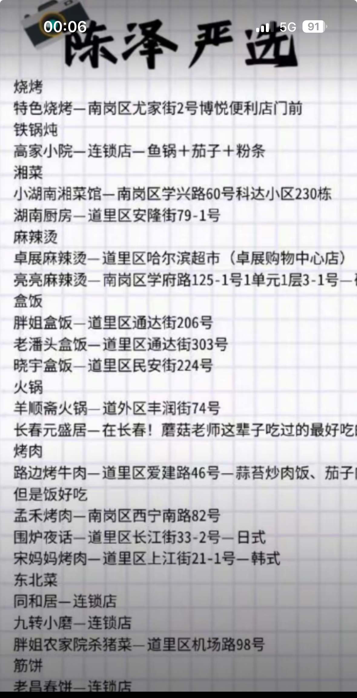

# 寒假哈尔滨三天四夜旅游规划（第二版）

## 酒店选择

- **不选择中央大街旁边的**（贵到离谱）
- **选择市区离地铁站近的**，因为地铁可以抵达主要景点，非常方便且不拥堵。
- **预估人均**：90元/晚

## 必备衣物

### 大棉鞋 / 二棉鞋

### 厚的手套

### 羽绒服和保暖裤

## 项目选择

### 自然景点篇

| 项目                        | 类型     | 价格 | 推荐程度 |
| --------------------------- | -------- | ---- | -------- |
| 冰雪大世界                  | 景点     | 240  | 必去     |
| 中央大街                    | 景点     | free | 必去     |
| 圣索菲亚大教堂              | 景点     | free | 必去     |
| 松花江铁道（可看日落）      | 景点     | free | 必去     |
| 防洪纪念塔                  | 景点     | free | 必去     |
| 松花江铁路桥                | 景点     | free | 必去     |
| 东北虎林园                  | 景点     | 82   | 推荐     |
| 中华巴洛克风情街            | 景点     | free | 推荐     |
| 731部队遗址                 | 人文景点 | free | 推荐     |
| 哈尔滨极地公园极地馆        | 景点     | 193  | 可选     |
| 哈尔滨极地公园海洋馆+企鹅馆 | 景点     | 111  | 可选     |
| 波塞冬海底世界              | 景点     | 99   | 可选     |
| 太阳岛雪博会                | 景点     | free | 可选     |
| 东北林业大学森林博物馆      | 人文景点 | free | 可选     |
| 亚布力滑雪场                | 人文景点 | 300  | 可选     |
| 东北林业大学滑冰场          | 人文景点 | free | 可选     |

### 美食篇

| 项目             | 类型     | 价格              | 推荐程度 |
| ---------------- | -------- | ----------------- | -------- |
| 高家小院铁锅炖   | 餐饮店   | 东北菜 人均50     | 必去     |
| 老厨家           | 餐饮店   | 东北菜 人均50     | 必去     |
| 哈尔滨红肠       | 特色美食 | 东北特色 一斤40   | 推荐     |
| 中央大街俄餐     | 餐饮店   | 东北特色 人均60   | 推荐     |
| 同和居           | 餐饮店   | 东北菜 人均50     | 推荐     |
| 哈尔滨红砖街早市 | 餐饮店   | 东北特色 free     | 可选     |
| 小湖南湘菜馆     | 餐饮店   | 陈泽推荐          | 可选     |
| 羊顺斋火锅       | 餐饮店   | 陈泽推荐          | 可选     |
| 老昌春饼         | 餐饮店   | 陈泽推荐 东北菜   | 可选     |
| 九转小磨         | 餐饮店   | 陈泽推荐   东北菜 |          |

### 休闲篇

| 项目     | 类型   | 费用 | 推荐程度 |
| -------- | ------ | ---- | -------- |
| 滨果汤泉 | 大澡堂 | 120  | 必去     |

## 日程安排

### 第零天

白天下午抵达哈尔滨，进入酒店，晚上可以吃个饭

### 第一天

| 项目             | 费用                 |
| ---------------- | -------------------- |
| 中华巴洛克风情街 | 0                    |
| 铁锅炖           | 50                   |
| 松花江铁路桥     | 0                    |
| 防洪纪念塔       | 0                    |
| 中央大街         | 50（可能要买纪念品） |
| 圣索菲亚大教堂   | 0（如找专业拍照+40） |
| 俄餐             | 晚餐70               |

**总计**：约150元

### 第二天

| 项目             | 费用 |
| ---------------- | ---- |
| 早饭             | 20   |
| 哈尔滨冰雪大世界 | 240  |
| 晚餐（东北菜）   | 30   |
| 滨果汤泉         | 110  |

**总计**：约400元

### 第三天

| 项目           | 费用 |
| -------------- | ---- |
| 哈尔滨早市     | 20   |
| 东北虎林园     | 82   |
| 吃饭           | 30   |
| 太阳岛         | 0    |
| 哈尔滨极地公园 | 150· |
| 老厨家         | 40   |

**总计**：约320元

### 第四天

**回家**：高铁费用910元

## 消费总计

- **总费用（含返程高铁票）**2100-2300

### 可控因素

1. **极地公园可不选**：-150元  
2. **某天减少饭店就餐次数**：-100元  
3. 坐火车回家可以省500元

