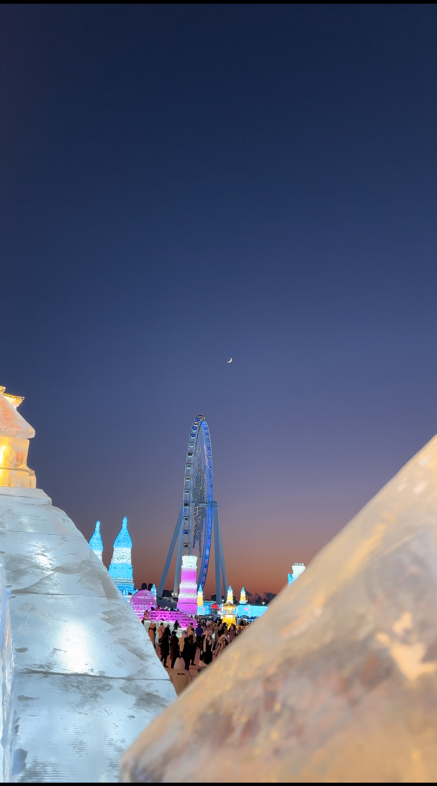

# ❄️寒假哈尔滨三天四夜旅游规划（六人旅游版）❄️

## 酒店选择

**[道外中华巴洛克花涧堂酒店](https://j.map.baidu.com/d9/vr-i)**

- 人均 `170` r 一夜，一共住3夜。

- 这是个==好酒店！==
  - 最市区，离景点超近👍
  - 离地铁站530米，走路8分钟，好👍。
  - 还提供免费早餐😋(#`O′)

## 必备物品

==棉鞋！！！==❄️

==手套！！！==❄️

==棉帽！！！==❄️

保暖裤

充电宝

tips：衣物到本地再买，也可以，稍微麻烦一点儿。

## 日程安排

> 以下为暂定，还有好多景点收藏在景点目录里面，可供挑选。。。

### 1.12 中央大街🏰

下午抵达哈尔滨，进入酒店，然后去直接去 逛街 + 吃饭。

这一部分景点离酒店很近，逛不完可以随时来弥补。

| 项目           | 费用                 |
| -------------- | -------------------- |
| 中华巴洛克     | 0                    |
| 松花江铁路桥   | 0                    |
| 防洪纪念塔     | 0                    |
| 圣索菲亚大教堂 | 0（如找专业拍照+40） |
| 中央大街       | 50（可能要买纪念品） |
| 俄餐           | 晚餐50               |

**总计**：约 50~100r

### 1.13 冰雪大世界❄️

| 项目             | 费用 |
| ---------------- | ---- |
| 早饭             | 0    |
| 哈尔滨冰雪大世界 | 240  |
| 晚饭             | 40   |

**总计**：约 300r

### 1.14 亚布力滑雪场❄️

| 项目                                   | 费用 |
| -------------------------------------- | ---- |
| 早饭                                   | 0    |
| `8：00` 乘坐高铁去亚布力西站           | 76   |
| 亚布力滑雪场                           | 180  |
| 下午乘坐高铁回市区                     | 76   |
| 晚上自由活动 可以 看看 兆麟公园 冰灯展 | 0    |
| 晚餐（东北菜） 火锅 … 想吃啥去吃啥     | 40   |

**总计**：约 400r

### 1.15 东北虎林园🐅

| 项目           | 费用 |
| -------------- | ---- |
| 红砖街早市     | 20   |
| 东北虎林园     | 82   |
| 吃饭 [铁锅炖…] | 50   |
| 自由活动       |      |
| 回酒店提行李   |      |
| 滨果汤泉       | 164  |

总计：320

### 1.16

**回家**：高铁费用910元

## 景点目录

### 自然景点篇

| 项目                        | 类型     | 价格 | 推荐程度 |
| --------------------------- | -------- | ---- | -------- |
| 冰雪大世界❄️                 | 景点     | 240  | 必去     |
| 中央大街                    | 景点     | free | 必去     |
| 圣索菲亚大教堂              | 景点     | free | 必去     |
| 松花江铁道（可看日落）      | 景点     | free | 必去     |
| 防洪纪念塔                  | 景点     | free | 必去     |
| 松花江铁路桥                | 景点     | free | 必去     |
| 东北虎林园                  | 景点     | 82   | 推荐     |
| 中华巴洛克风情街            | 景点     | free | 推荐     |
| 731部队遗址                 | 人文景点 | free | 推荐     |
| 哈尔滨极地公园极地馆        | 景点     | 193  | 可选     |
| 哈尔滨极地公园海洋馆+企鹅馆 | 景点     | 111  | 可选     |
| 波塞冬海底世界              | 景点     | 99   | 可选     |
| 太阳岛雪博会                | 景点     | free | 可选     |
| 东北林业大学森林博物馆      | 人文景点 | free | 可选     |
| 亚布力滑雪场                | 人文景点 | 300  | 可选     |
| 东北林业大学滑冰场          | 人文景点 | free | 可选     |
| 亚布力滑雪场                | 景点     | 200  | 必去     |
| 亚布力高山缆车              | 景点     | 180  | 必去     |
| 兆麟公园 冰灯展             |          | 0    |          |

#### 亚布力景观

#### 中央大街

#### 冰雪大世界

### 美食篇

| 项目                       | 类型   | 价格          | 推荐程度 |
| -------------------------- | ------ | ------------- | -------- |
| 哈尔滨红肠                 | 东北菜 | 一斤40        | 推荐     |
| 同和居                     | 东北菜 | 人均50        | 推荐     |
| 老厨家                     | 东北菜 | 人均50        | 必去     |
| 九转小磨（陈泽严选）       | 东北菜 | 东北菜        |          |
| 老昌春饼（陈泽严选）       | 东北菜 | 东北菜        | 可选     |
| 中央大街俄餐               | 餐饮店 | 人均70        | 推荐     |
| 高家小院铁锅炖（陈泽严选） | 餐饮店 | 东北菜 人均50 | 必去     |
| 哈尔滨红砖街早市           | 餐饮店 | 特色          | 可选     |
| 小湖南湘菜馆（陈泽严选）   | 餐饮店 |               | 可选     |
| 羊顺斋火锅（陈泽严选）     | 餐饮店 |               | 可选     |
| 湖南厨房（陈泽严选）       | 餐饮店 |               |          |
| 羊顺斋火锅（陈泽严选）     | 餐饮店 |               |          |

### 休闲篇

| 项目     | 类型   | 费用 | 推荐程度 |
| -------- | ------ | ---- | -------- |
| 滨果汤泉 | 大澡堂 | 120  | 必去     |
| 澜庭水汇 | 大澡堂 | 100  | 推荐     |

## 消费总计

约1630 (不包括返程票)
